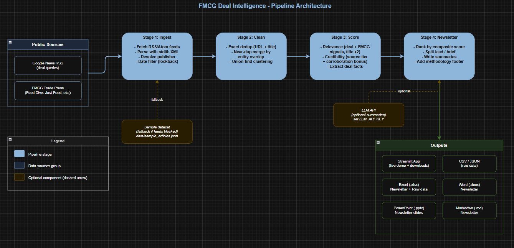

# FMCG Deal Intelligence

A small, transparent pipeline that turns public news into a concise
**FMCG (fast-moving consumer goods) M&A and investment newsletter** a business
user can skim in two minutes.

Pipeline thinking: `ingest -> clean -> score -> newsletter`.

## Architecture



---

## What it does (the five requirements)

| Requirement | How it is met |
|---|---|
| **Aggregate deal-related FMCG news** | Pulls public RSS feeds: Google News search feeds for FMCG deal queries plus direct trade-press feeds (`src/ingest.py`, `src/config.py`). |
| **Remove duplicates / near-duplicates** | Exact match on normalised URL and title, then near-duplicate clustering by shared named entities and figures using union-find (`src/clean.py`). |
| **Filter for FMCG-deal relevance** | Dual-gated relevance score: an item must show both a deal signal and an FMCG signal, or it is dropped (`src/score.py`). |
| **Check basic source credibility** | Source-tier allow-list (wire/financial > trade > general > PR wire > unknown) plus a corroboration bonus and a lone-press-release penalty (`src/score.py`, `src/config.py`). |
| **Output a short, structured newsletter** | Ranked lead deals + an "also in the news" tail, per-deal summaries, an at-a-glance intro and a methodology footer (`src/newsletter.py`), exported to Markdown / Word / PowerPoint / Excel + raw CSV/JSON. |

---

## Pipeline explained

### 1. Ingestion - `src/ingest.py`
Pulls **public RSS feeds only** (no API key, no scraping). Google News exposes a
keyless RSS endpoint for any search query:

```
https://news.google.com/rss/search?q=FMCG+acquisition&hl=en-US&gl=US&ceid=US:en
```

For each phrase in `GOOGLE_NEWS_QUERIES` (`src/config.py`) the code builds one of
these URLs; Google does the web-wide searching and returns XML with each
article's title, link, date and **original publisher**. `DIRECT_FEEDS` adds FMCG
trade sites (Food Dive, Just-Food, etc.). Parsing uses the standard library
(`requests` + `xml.etree`), and each item is normalised and filtered to a
look-back window.

Why RSS: free, keyless, paywall-free, and robust to site redesigns. To change
coverage, edit `src/config.py` (add queries, change region via
`google_news_rss()`, or add a feed URL).

### 2. Cleaning and de-duplication - `src/clean.py`
The same deal is reported by many outlets; we keep each **deal** once while
counting how many independent outlets covered it.

- **Exact dedup** on normalised URL (tracking params stripped) and title.
- **Near-duplicate merge:** each story is fingerprinted by its named entities and
  figures plus content words. Two reports merge when they share at least 2
  entities and their blended overlap reaches `0.50`:

  ```
  similarity   = 0.5 * entity_overlap + 0.5 * content_overlap
  overlap(A,B) = |A ∩ B| / min(|A|, |B|)
  ```

  Headlines get reworded but company names and figures stay constant, so entity
  overlap is the discriminating signal. Clustering uses union-find; each cluster
  keeps its most credible, then most recent report and the rest become
  *corroboration*.

### 3. Scoring - `src/score.py`
Transparent, rule-based scorers (every score is explained by `matched_*` fields):

- **Relevance (0-100), dual-gated.** Needs both a deal signal (`acquire`,
  `merger`, `stake`, `IPO`, ...) and an FMCG signal (a category like
  *beverage/snack* or a named company like *Nestle/PepsiCo*). Title matches count
  double; missing either signal caps the item below the threshold.
- **Credibility (0-100), source-based.** Tiered allow-list plus a corroboration
  bonus and a lone-press-release penalty. We rate the source's standing, not the
  truth of a claim.
- **Deal-fact extraction.** Regex for deal value, type and parties.

### 4. Newsletter - `src/newsletter.py`
Ranks by relevance (45%), credibility (30%), recency (15%), corroboration (10%),
splits into lead deals and an "also in the news" tail, writes per-deal summaries,
and appends an intro and methodology footer. Summaries use an LLM when
`LLM_API_KEY` is set, with a template fallback otherwise.

---

## Key assumptions

- We score the **source's standing**, not individual claims; press-release wires
  are flagged and a lone release is penalised.
- Deal value/parties are regex heuristics and may be partial; the source link is
  always provided.
- Coverage is limited to what public feeds surface. Decision-support, not
  investment advice.
- Sources, vocabularies, tiers and thresholds all live in `src/config.py`.

---

## Run it locally

```bash
git clone https://github.com/Aviral-77/beroni.git
cd beroni
pip install -r requirements.txt

streamlit run app.py                                  # demo app
python scripts/run_pipeline.py                        # CLI: write all outputs
python scripts/run_pipeline.py --no-llm --days 7 --min-relevance 40
```

Outputs go to `data/outputs/` (CSV, JSON, XLSX, DOCX, PPTX, MD).

**Optional LLM summaries:** set `LLM_API_KEY` and `FMCG_LLM_MODEL`. Without a key
the app uses template summaries and works the same otherwise.

```bash
export LLM_API_KEY=your-api-key-here
export FMCG_LLM_MODEL=your-model-name-here
```

---

## Using the demo app

**Sidebar:** look-back window (days), minimum relevance score, an LLM-summaries
toggle, and a Run button (results cached 15 minutes).

**Tabs:**

| Tab | What it shows |
|-----|---------------|
| **Newsletter** | The finished newsletter: lead deals with summaries and sources, an "also in the news" list, and the methodology note. |
| **Raw data** | Every de-duplicated article with its scores (relevance, credibility, deal type, cluster size). |
| **Pipeline logic** | A plain explanation of each step plus a per-feed fetch log. |
| **Downloads** | Buttons for raw data (CSV, JSON) and the newsletter (Excel, Word, PowerPoint, Markdown). |

A pipeline funnel at the top shows how the list shrinks at each stage.

---

## Deploy

**Streamlit Community Cloud (free):** push to GitHub, go to
[share.streamlit.io](https://share.streamlit.io) -> New app -> pick the repo,
branch and `app.py`. Optionally add `LLM_API_KEY` and `FMCG_LLM_MODEL` under
Advanced settings -> Secrets. The app needs outbound internet to pull live feeds.

---

## Project structure

```
beroni/
├── app.py                  # Streamlit demo app
├── scripts/run_pipeline.py # CLI: run pipeline -> write all deliverables
├── src/
│   ├── config.py           # sources, keyword vocab, credibility tiers, thresholds
│   ├── ingest.py           # Stage 1 - RSS ingestion (stdlib parser)
│   ├── clean.py            # Stage 2 - exact + near-duplicate de-duplication
│   ├── score.py            # Stage 3 - relevance + credibility + fact extraction
│   ├── newsletter.py       # Stage 4 - ranking, summaries, draft
│   ├── exporters.py        # CSV / JSON / Excel / Word / PowerPoint
│   └── pipeline.py         # orchestrates the four stages
├── data/outputs/           # committed sample deliverables
├── assets/                 # architecture diagram
├── docs/                   # pipeline and architecture notes
└── requirements.txt
```

---

## Things to note

- Coverage is only as good as the public feeds; private or paywalled deals are
  out of scope.
- Deal value and parties come from regex, so they can be partial. The source link
  is always there to verify.
- Credibility scores the source's standing, not whether a specific claim is true.
- Google News RSS can rate-limit or change format; the trade-press feeds act as a
  steady backup.

## Possible improvements

- Add more sources and region-specific queries (e.g. India, Europe).
- Smarter entity extraction (an NER model) instead of capitalised-token heuristics.
- A lightweight cache or database to track deals over time instead of per-run only.
- Optional email or Slack delivery of the finished newsletter.
