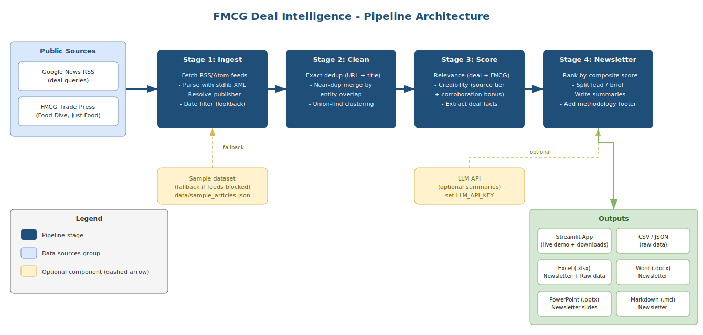

# FMCG Deal Intelligence

A small, transparent **agent pipeline** that turns public news into a concise
**FMCG (fast-moving consumer goods) M&A & investment newsletter** a business
user can skim in two minutes.

It aggregates deal-related news, removes duplicates and near-duplicates, filters
for genuine FMCG-deal relevance, checks basic source credibility, and emits a
short, structured newsletter - plus the raw data and the newsletter in
Excel / Word / PowerPoint.

> **Pipeline / "agent" thinking:** `ingestion -> cleaning -> scoring -> newsletter`

## Architecture

<!--  -->


---

## Pipeline explained (with the logic that matters)

### 1 · Ingestion - `src/ingest.py`
Pulls from **public RSS/Atom feeds only** (no paywalls, no scraping): Google
News search feeds for FMCG deal queries - which conveniently attribute each item
to its **original publisher** for credibility scoring - plus direct FMCG trade
press. Parsing uses the standard library (`requests` + `xml.etree`), so there are
no heavyweight/compiled dependencies. Each item is normalised to
`{title, summary, url, publisher, source_domain, published}` and filtered to a
look-back window.

#### How the live data is fetched (no API key, no scraping)

The pipeline pulls **public RSS feeds** only. There is no paid API and no HTML
scraping - just structured XML that is free and stable.

**1. Google News RSS (the main source).** Google News exposes a hidden RSS
endpoint for *any* search query, with no API key. The URL format is:

```
https://news.google.com/rss/search?q=FMCG+acquisition&hl=en-US&gl=US&ceid=US:en
```

For each phrase in `GOOGLE_NEWS_QUERIES` (`src/config.py`) - `FMCG acquisition`,
`consumer goods acquisition`, `FMCG private equity stake`, and so on - the code
builds one of these URLs. Google does the web-wide searching and hands back an
XML list of matching articles, each with its title, link, date, and the
**original publisher** (Reuters, Food Dive, etc.), which is exactly what the
credibility scorer needs.

**2. Direct trade-press feeds.** `DIRECT_FEEDS` (`src/config.py`) is a fixed list
of FMCG industry sites that publish their own RSS (Food Dive, Just-Food, Beverage
Daily, etc.) for clean, on-topic coverage.

The fetch path in `src/ingest.py` is:

```
ingest()                       # loops over every feed
  -> fetch_raw(url)            # HTTP GET -> raw XML bytes
       -> parse_feed(raw) # stdlib xml.etree -> list of articles
            -> date filter      # drop anything older than the look-back window
```

`fetch_raw()` does a plain `requests.get()` with a browser-like User-Agent and a
15-second timeout. `parse_feed()` reads each `<item>` with the standard-library
XML parser (no `feedparser` dependency) and normalises it to
`{id, title, summary, url, publisher, source_domain, published}`.

**Why RSS:** it is free and keyless, it does not break on site redesigns the way
scraping does, it avoids paywalls, and Google does the heavy discovery work and
attributes each story to its real publisher. To change coverage you only edit
`src/config.py`: add or edit query strings, point `google_news_rss()` at another
region/language (e.g. `gl=IN, hl=en-IN`), or drop a new feed URL into
`DIRECT_FEEDS`.

### 2 · Cleaning & de-duplication - `src/clean.py`
The same deal is reported by many outlets; we want each **deal** once, while
remembering how many independent outlets covered it.

- **Exact dedup** on a normalised URL (tracking params stripped) and a
  normalised title.
- **Near-duplicate merge** - the interesting part. Each story is *fingerprinted*
  by its **named entities** (capitalised company/brand tokens) and **figures**
  (deal values), plus significant content words. Two reports are merged when
  they **share ≥ 2 entities** *and* their blended **overlap score** ≥ `0.50`,
  where the score is:

  ```
  similarity = 0.5 · entity_overlap + 0.5 · content_overlap
  overlap(A, B) = |A ∩ B| / min(|A|, |B|)        # overlap coefficient
  ```

  Headlines are reworded freely across outlets, but the **company names, brands
  and figures stay constant** - so entity overlap is the dominant, discriminating
  signal, and the "≥ 2 shared entities" gate stops two unrelated stories that
  merely share one common word from being merged. Clustering uses **union-find**,
  and each cluster keeps its **most credible, then most recent** report as the
  representative; the others become *corroboration*.

### 3 · Scoring - `src/score.py`
Three transparent, rule-based scorers (no black boxes - every score is
explained by the `matched_*` fields attached to each article):

- **Relevance (0–100), dual-gated.** An item must show **both** a *deal signal*
  (`acquire`, `merger`, `stake`, `divest`, `funding round`, `IPO) and an
  *FMCG signal* (a category like *beverage/personal care/snack* or a named
  consumer-goods company like *Nestlé/PepsiCo/Unilever*). **Title matches count
  double.** If either signal is missing the item is marked not-relevant and
  capped - so generic business news and non-deal FMCG news fall below the
  threshold and are dropped.
- **Credibility (0–100), source-based.** A transparent tier allow-list -
  global wire / financial press (Tier 1) > established trade press (Tier 2) >
  general/market news (Tier 3) > press-release wires (flagged) > unknown - plus
  a **corroboration bonus** when several independent outlets report the same
  deal, minus a penalty for a **lone press release**. We rate the *source's
  standing*, not the truth of any individual claim.
- **Deal-fact extraction.** Best-effort regex for deal **value** (`$36 billion`),
  **type** (acquisition / merger / divestiture / investment / funding / IPO) and
  **parties** (acquirer -> target).

### 4 · Newsletter - `src/newsletter.py`
Ranks by a composite of **relevance (45%), credibility (30%), recency (15%),
corroboration (10%)**, splits into **lead deals** and an *"also in the news"*
tail, writes a per-deal summary, and appends an at-a-glance intro and a
**methodology footer**. Summaries are written by an LLM when an `LLM_API_KEY`
is present, with a **transparent template fallback** so the demo is fully
functional with zero credentials.

---

## Credibility & transparent assumptions

- **We score the source, not the claim.** Credibility reflects an outlet's
  editorial standing (a tiered allow-list in `src/config.py`), plus how many
  *independent* outlets corroborate a deal. We do not fact-check individual
  statements.
- **Press-release wires are flagged** (PR Newswire, Business Wire, GlobeNewswire,
  …) and a lone, un-corroborated release is penalised - factual for
  announcements, but primary PR rather than independent journalism.
- **Deal value / parties are heuristic** (regex) and may be partial; the source
  link is always provided so a reader can verify.
- **Coverage = what public feeds surface.** Private deals and paywalled scoops
  are out of scope by design.
- **Everything is tunable and visible** - sources, keyword vocabularies,
  credibility tiers and thresholds all live in `src/config.py`, and the app
  shows the per-stage funnel and per-feed fetch log.
- **Decision-support, not investment advice.**

---

## Run it locally

```bash
git clone https://github.com/Aviral-77/beroni.git
cd beroni
pip install -r requirements.txt

# Option A - the demo app
streamlit run app.py

# Option B - generate every deliverable from the CLI
python scripts/run_pipeline.py                 # live feeds, falls back to sample
python scripts/run_pipeline.py --sample        # force the bundled dataset
python scripts/run_pipeline.py --no-llm --days 7 --min-relevance 40
```

Outputs are written to `data/outputs/` (CSV, JSON, XLSX, DOCX, PPTX, MD).

**Optional - LLM-written summaries:** set `LLM_API_KEY` and `FMCG_LLM_MODEL`
(the model identifier for your LLM provider). Without a key the app uses template
summaries and works exactly the same otherwise.

```bash
export LLM_API_KEY=your-api-key-here
export FMCG_LLM_MODEL=your-model-name-here
```

---

## Using the demo app

Once `streamlit run app.py` is up, here is what every control does.

### Sidebar (left)

| Control | What it does |
|---------|--------------|
| **Data source** | Switch between "Live news feeds" (pulls real RSS in real time) and "Bundled sample" (the fixed offline dataset). If live mode can't reach the feeds, it quietly falls back to the sample. |
| **Look-back window (days)** | How far back to keep news. A smaller number means fewer, more recent stories. |
| **Minimum relevance score** | The cut-off for the relevance score. Raise it to keep only the strongest deal stories; lower it to let more through. |
| **Use LLM for summaries** | On: an LLM writes the per-deal summaries (needs an API key). Off: plain template summaries are used. |
| **Run pipeline** | Runs all four steps again with the current settings. Results are cached for 15 minutes, so flipping a switch and pressing this is quick. |

### Top of the page

- **Status banner** tells you whether you are on live data or the sample.
- **Pipeline funnel** is a row of numbers showing how the list shrinks at each
  step: how many articles came in, how many were left after de-duplication, how
  many were relevant, how many made the lead section, and whether summaries came
  from the LLM or the template.

### Tabs

| Tab | What it shows |
|-----|---------------|
| **Newsletter** | The finished newsletter: lead deals with summaries and sources, a short "also in the news" list, and the methodology note. This is the main output. |
| **Raw data** | A table of every de-duplicated article with its scores (relevance, credibility, deal type, cluster size, and so on). Good for checking why a story ranked where it did. |
| **Pipeline logic** | A plain explanation of each step, the assumptions for this run, and an expandable per-feed fetch log showing which feeds were reached. |
| **Downloads** | Buttons to download the raw data (CSV, JSON) and the newsletter (Excel, Word, PowerPoint, Markdown). |

---

## Deploy the demo app

**Streamlit Community Cloud (free, ~2 minutes):**

1. Push this repo to GitHub.
2. Go to [share.streamlit.io](https://share.streamlit.io) -> **New app** -> pick
   this repo, branch, and `app.py`.
3. *(Optional)* add `LLM_API_KEY` and `FMCG_LLM_MODEL` under **Advanced settings -> Secrets** to
   enable LLM summaries.
4. Deploy, then paste the resulting URL into the [Links](#links-final-deliverable)
   table above.

The app needs open outbound internet to pull live feeds; on a restricted host it
automatically falls back to the bundled sample so it always renders.

---

## Project structure

```
beroni/
├── app.py                  # Streamlit demo app
├── scripts/run_pipeline.py # CLI: run pipeline -> write all deliverables
├── src/
│   ├── config.py           # sources, keyword vocab, credibility tiers, thresholds
│   ├── ingest.py           # Stage 1 - RSS/Atom ingestion (stdlib parser)
│   ├── clean.py            # Stage 2 - exact + near-duplicate de-duplication
│   ├── score.py            # Stage 3 - relevance + credibility + fact extraction
│   ├── newsletter.py       # Stage 4 - ranking, summaries (LLM/template), draft
│   ├── exporters.py        # CSV / JSON / Excel / Word / PowerPoint
│   └── pipeline.py         # the "agent" - orchestrates the four stages
├── data/
│   ├── sample_articles.json   # illustrative offline dataset (clearly labelled)
│   └── outputs/               # committed sample deliverables
├── assets/architecture.svg
├── docs/architecture.md
└── requirements.txt
```

---

## Note on the sample dataset

`data/sample_articles.json` is an **illustrative snapshot** seeded from publicly
reported FMCG deals, with publication dates normalised to a recent window purely
for demonstration. It exists so the app, the pipeline tests and the committed
deliverables work even when a host blocks outbound news access. **In live mode
the app ingests real-time public feeds.** The dataset deliberately includes
duplicate reports of the same deal and a few off-topic items, so the
de-duplication and relevance logic are visible end-to-end.
